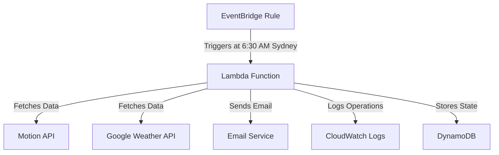

# Daily Digest Assistant - Architecture Document

> **Migration Note:** As of [DATE], the weather integration is migrating from IBM/The Weather Company to the Google Weather API. See `CHANGE_REQUEST - 1.1 Google Weather API.md` for rationale and migration plan.

## 1. System Overview

### 1.1 Purpose
The Daily Digest Assistant is a serverless application that delivers personalized morning briefings via email at 6:30 AM Sydney time. It combines calendar data from Motion with weather information (now sourced from Google Weather API), presented with British-style personality and humor.

### 1.2 Core Components
- **Motion API Integration**: Retrieves calendar data
- **Google Weather API Integration**: Fetches weather information
- **Email Generation**: Creates personalized digest content
- **Email Delivery**: Sends the digest via email service
- **Scheduling System**: Ensures 6:30 AM Sydney time delivery
- **Monitoring System**: Tracks system health and performance

### 1.3 Architecture Pattern
- Serverless architecture using AWS services
- Event-driven design with scheduled execution
- Single-user system with no user management
- Stateless operation with minimal data persistence

## 2. Technical Architecture

### 2.1 Infrastructure Components

### 2.2 AWS Services
- **Compute**: AWS Lambda
- **Scheduling**: EventBridge
- **Storage**: DynamoDB
- **Monitoring**: CloudWatch
- **Secrets**: Secrets Manager
- **CI/CD**: GitHub Actions

### 2.3 Data Flow
1. **Data Collection**
   - EventBridge triggers Lambda at 6:30 AM Sydney time
   - Lambda sequentially fetches data from Motion API
   - Lambda fetches weather data from Google Weather API
   - All API calls include retry logic and error handling

2. **Data Processing**
   - Calendar data is processed and formatted
   - Weather data is processed and formatted
   - Content is generated with British personality
   - Email template is populated with processed data

3. **Delivery**
   - Email is generated using mobile-first template
   - Email is sent via email service
   - Delivery status is logged
   - Success/failure is monitored

## 3. Technical Decisions

### 3.1 API Request Handling
- **Sequential Processing**
  - Chosen for simplicity and reliability
  - Easier error handling and debugging
  - Sufficient for daily digest requirements
  - No concurrent request handling needed

- **Error Handling**
  - Exponential backoff retry mechanism
  - Maximum 3 retry attempts
  - 5-minute delay between retries
  - Graceful degradation on API failures

### 3.2 Data Management
- **No Caching Strategy**
  - Fresh data required for each digest
  - No stale data concerns
  - Simplified implementation
  - Reduced storage costs

- **State Management**
  - Minimal state stored in DynamoDB
  - Only essential operational data
  - No PII or sensitive information
  - 30-day retention period

### 3.3 Email System
- **Template Design**
  - Mobile-first responsive design
  - Simple HTML structure
  - British personality integration
  - Consistent formatting

- **Delivery System**
  - Retry mechanism for failed deliveries
  - Delivery status tracking
  - Error notification system
  - Delivery confirmation logging

## 4. Security & Compliance

### 4.1 Credential Management
- **API Keys**
  - Stored in AWS Secrets Manager
  - Regular rotation schedule
  - Least privilege access
  - Encrypted at rest

- **Access Control**
  - IAM roles with minimal permissions
  - No public access
  - Secure API endpoints
  - Regular access reviews

### 4.2 Data Protection
- **No PII Storage**
  - Calendar data processed in memory
  - No persistent storage of personal data
  - Secure logging practices
  - Regular security audits

- **Logging & Monitoring**
  - Structured logging
  - No sensitive data in logs
  - Log retention policies
  - Regular log reviews

## 5. Monitoring & Operations

### 5.1 Key Metrics
- **Lambda Metrics**
  - Execution success/failure
  - Duration
  - Memory usage
  - Error rates

- **API Metrics**
  - Response times
  - Error rates
  - Retry attempts
  - Success rates

- **Email Metrics**
  - Delivery success
  - Delivery time
  - Template rendering
  - Content generation

### 5.2 Alerting
- **Critical Alerts**
  - Lambda execution failures
  - Email delivery failures
  - Schedule misses
  - API timeouts

- **Warning Alerts**
  - High latency
  - Approaching rate limits
  - Retry attempts
  - Resource usage

## 6. Disaster Recovery

### 6.1 Recovery Procedures
- **Lambda Function**
  - Version control
  - Rollback capability
  - Deployment history
  - Quick recovery

- **API Failures**
  - Fallback content
  - Graceful degradation
  - Error notifications
  - Manual intervention process

### 6.2 Backup Strategies
- **State Management**
  - DynamoDB backups
  - Configuration versioning
  - Log retention
  - Deployment artifacts

## 7. Cost Management

### 7.1 Cost Structure
- **Lambda Costs**
  - Execution time: ~1 minute daily
  - Memory: 256MB
  - Estimated: < $1/month

- **Other Services**
  - EventBridge: < $1/month
  - DynamoDB: < $1/month
  - CloudWatch: < $1/month
  - Total: $2-4/month

### 7.2 Optimization
- **Resource Optimization**
  - Memory allocation
  - Execution time limits
  - Log retention policies
  - Cost monitoring

## 8. Future Considerations

### 8.1 Scalability
- **Multi-user Support**
  - Architecture allows for future expansion
  - No current implementation needed
  - Design considerations in place
  - Cost implications documented

### 8.2 Maintenance
- **Regular Updates**
  - Dependency updates
  - Security patches
  - Performance optimization
  - Documentation updates

## 9. Implementation Notes

### 9.1 Development Environment
- Python 3.9
- AWS CDK
- GitHub Actions
- Local testing tools

### 9.2 Deployment Process
- Staging environment
- Production environment
- Rollback procedures
- Monitoring setup

### 9.3 Testing Strategy
- Unit tests
- Integration tests
- End-to-end tests
- Performance tests

## 10. Documentation

### 10.1 Related Documents
- `README.md`: Project setup and overview
- `CONTRIBUTING.md`: Development guidelines
- `SECURITY.md`: Security procedures
- `CHANGELOG.md`: Version history

### 10.2 API Documentation
- Motion API integration
- Google Weather API integration
- Email service integration
- AWS service integration