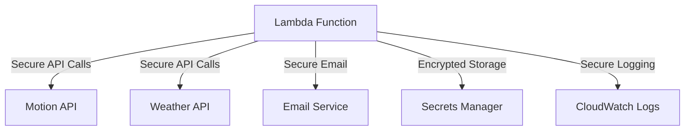

# Security Policy

## 1. Security Overview

### 1.1 Security Model
The Daily Digest Assistant follows a single-user security model with the following principles:
- No user authentication required
- No PII storage
- Minimal data persistence
- Secure API key management
- Regular security audits

### 1.2 Security Boundaries


## 2. Credential Management

### 2.1 API Keys
```python
# Storage Location
AWS Secrets Manager
Path: /digest/{env}/motion-api-key
Path: /digest/{env}/weather-api-key
Path: /digest/{env}/email-service-key

# Rotation Schedule
- Motion API Key: Every 90 days
- Weather API Key: Every 90 days
- Email Service Key: Every 90 days
```

### 2.2 Access Control
```python
# IAM Policy Example
{
    "Version": "2012-10-17",
    "Statement": [
        {
            "Effect": "Allow",
            "Action": [
                "secretsmanager:GetSecretValue"
            ],
            "Resource": [
                "arn:aws:secretsmanager:region:account:secret:/digest/*"
            ]
        }
    ]
}
```

## 3. Data Protection

### 3.1 Data Classification
| Data Type | Classification | Storage | Retention |
|-----------|---------------|---------|-----------|
| Calendar Data | Non-sensitive | Memory only | None |
| Weather Data | Non-sensitive | Memory only | None |
| API Keys | Sensitive | Secrets Manager | 90 days |
| Logs | Non-sensitive | CloudWatch | 30 days |

### 3.2 Data Flow Security
1. **API Communications**
   - HTTPS only
   - TLS 1.2 or higher
   - Certificate validation
   - No sensitive data in URLs

2. **Email Security**
   - TLS for SMTP
   - SPF/DKIM configured
   - No sensitive data in emails
   - Secure email service

## 4. Security Controls

### 4.1 Input Validation
```python
# Example of input validation
from typing import Dict, Any
from datetime import datetime

def validate_date(date_str: str) -> bool:
    """Validate date string format."""
    try:
        datetime.strptime(date_str, '%Y-%m-%d')
        return True
    except ValueError:
        return False

def sanitize_input(data: Dict[str, Any]) -> Dict[str, Any]:
    """Sanitize input data."""
    # Remove any potentially harmful characters
    return {
        k: v.strip() if isinstance(v, str) else v
        for k, v in data.items()
    }
```

### 4.2 Error Handling
```python
# Example of secure error handling
from aws_lambda_powertools import Logger

logger = Logger()

def handle_error(error: Exception) -> None:
    """Handle errors securely."""
    # Log error without sensitive data
    logger.error(
        "Operation failed",
        extra={
            "error_type": type(error).__name__,
            "error_message": str(error)
        }
    )
    # Don't expose internal details
    raise DigestError("Operation failed")
```

## 5. Monitoring and Logging

### 5.1 Security Logging
```python
# Example of security logging
def log_security_event(
    event_type: str,
    details: Dict[str, Any]
) -> None:
    """Log security-related events."""
    logger.info(
        "Security event",
        extra={
            "event_type": event_type,
            "timestamp": datetime.utcnow().isoformat(),
            "details": {
                k: v for k, v in details.items()
                if not k.startswith('_')
            }
        }
    )
```

### 5.2 Security Alerts
- API key rotation alerts
- Failed authentication attempts
- Unusual access patterns
- Rate limit violations

## 6. Incident Response

### 6.1 Security Incidents
1. **API Key Compromise**
   - Immediate key rotation
   - Review access logs
   - Update affected systems
   - Document incident

2. **Service Disruption**
   - Activate fallback procedures
   - Notify stakeholders
   - Investigate cause
   - Implement fixes

### 6.2 Response Procedures
```python
# Example incident response procedure
def handle_security_incident(
    incident_type: str,
    severity: str
) -> None:
    """Handle security incidents."""
    # Log incident
    log_security_event("incident", {
        "type": incident_type,
        "severity": severity,
        "timestamp": datetime.utcnow().isoformat()
    })
    
    # Take appropriate action
    if incident_type == "api_key_compromise":
        rotate_api_keys()
    elif incident_type == "service_disruption":
        activate_fallback()
```

## 7. Security Best Practices

### 7.1 Code Security
- Regular dependency updates
- Security scanning
- Code review requirements
- No hardcoded credentials

### 7.2 Infrastructure Security
- AWS security best practices
- Regular security audits
- Network security
- Resource isolation

## 8. Compliance

### 8.1 Security Standards
- AWS Well-Architected Framework
- OWASP Top 10
- Python security best practices
- AWS security best practices

### 8.2 Regular Reviews
- Monthly security reviews
- Quarterly penetration testing
- Annual security audit
- Continuous monitoring

## 9. Security Contacts

### 9.1 Reporting Security Issues
- Email: security@your-org.com
- Issue Template: Security Issue
- Response Time: 24 hours
- Confidentiality: Maintained

### 9.2 Security Team
- Primary Contact: [Name]
- Backup Contact: [Name]
- Escalation Path: [Details]

## 10. Security Updates

### 10.1 Update Process
1. Security patch identification
2. Impact assessment
3. Testing in staging
4. Production deployment
5. Verification

### 10.2 Update Schedule
- Critical updates: Immediate
- High priority: Within 24 hours
- Medium priority: Within 7 days
- Low priority: Within 30 days
